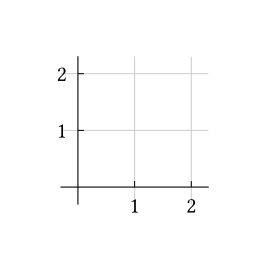
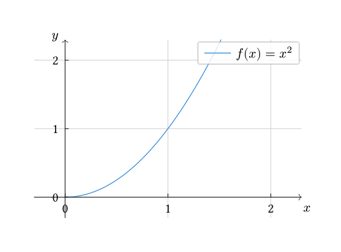
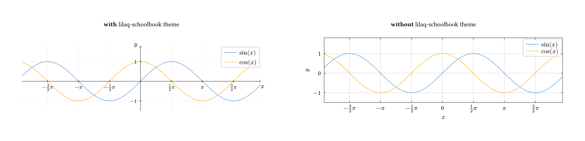

# Lilaq-schoolbook

_Lilaq-schoolbook_ is a typst package based on [lilaq](https://typst.app/universe/package/lilaq/) that provides three things: 
- a way to use _lilaq_'s `diagram()` function with controlled graduations interval length and scaling on each axis
- a `plot()` function which takes _lilaq_'s `linspace` function argument for generating a default array of $x$ coordinates.
- a fancy version of _lilaq_'s schoolbook theme 
Take a look at the [manual](https://github.com/Yesteeer/typst-lilaq-schoolbook/blob/master/docs/manual.pdf?raw=true) for more information on the API.

## Quickstart

Download the package locally (as described on the [Typst Packages](https://github.com/typst/packages)) repository. Then import and use _lilaq-schoolbook_.

```typst
#import "@local/lilaq-schoolbook:0.1.0" as sb
```

## Functions

The package comes with two functions `diagramm()` and `plot()` which are based respectively on _lilaq_'s `diagram()` and `plot()` functions. 

The former provides control graduations interval length and scaling on each axis, while the latter includes a way to generate a linearly distributed array of $x$ coordinates.

## Theme

The fancy schoolbook theme can be activated by using the show rule:

```typst
#show: sb.lilaq-schoolbook
```
Each of the following examples is compiled with and without the schoolbook theme.

## Examples

By default, `plot()` generates two perpendicular axes from 0 to 2 with a default offset of 0.3. The scale of both axes' graduation is 1:1cm.

```typst
#import "@local/lilaq-schoolbook:0.1.0": *

#set page(height: auto, margin: 1cm, width: auto)

#show: sb.lilaq-schoolbook

#sb.diagram()
```



We can now add a function using the `plot()` function as well as labels for both axes. We can also improve the visualization by  scaling both axes.

```typst
[...]

#sb.diagram(
  // add labels to axes
  labels: ($x$, $y$),
  // scale the axes' tick-distance
  scale: (3, 2),
  // add a function to the plot
  sb.plot(x => calc.pow(x, 2), label: $f(x) = x^2$),
)
```



Finally, we can use still use all of _lilaq_'s power for some more advanced results.

```typst
[...]

#import "@preview/lilaq:0.6.0" as lq

#sb.diagram(
  // set bottom-left limit coordinates
  start: (-6, -1.5),
  // set top-right limit coordinates
  end: (5.8, 1.5),
  // scale the axes' tick-distance
  scale: 1.2,
  // add axes' offset
  offset: (0, 0.3),
  // add labels to axes
  labels: ($x$, $y$),
  // add/update some arguments to pass to the xaxis() function
  add-to-xaxis: (
    tick-distance: 1/ 2,

    // sets horizontal ticks to follow multiples of pi
    locate-ticks: lq.tick-locate.linear.with(unit: calc.pi),

    // define custom tick label format
    format-ticks: lq.tick-format.fraction.with(suffix: $pi$),
  ),

  // add functions to the plot
  sb.plot(x => calc.sin(x), start: -6.5, end: 6.5, label: $sin(x)$),
  sb.plot(x => calc.cos(x), start: -6.5, end: 6.5, label: $cos(x)$),
)
```



